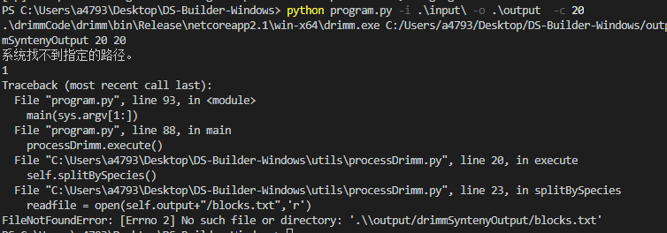
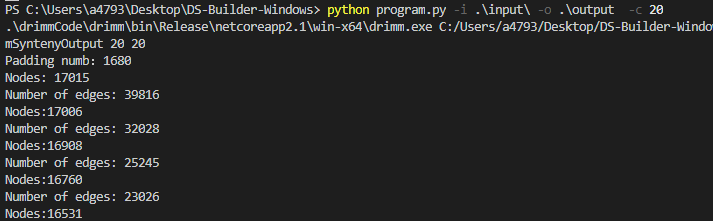

# DS-Builder-Windows使用说明

## 编译

基于各电脑的dotnet版本不同，我们需要进行用户自行编译,首先检查dotnet环境

```bash
dotnet --version
```

安装环境后进入到./drimmCode目录中,使用以下命令进行编译

```bash
dotnet publish -c Release -r win-x64
```

## 执行

```bash
python ./program.py -h
```

使用以下命令进行样例输入，-i 表示tsv与gff后缀文件路径，必须保证tsv与gff放在同一文件夹，-o 表示当前输入结果文件路径，

```bash
python program.py -i .\input\ -o .\output  -c 20
```

如果出现以下找不到路径情况，为未编译。请进行编译



出现以下输出才为正常输出




## 参数含义

-i   inputPath : Please enter the inputPath

-o   Outpath : Please enter the path generated by the output file

[-s]  MaxGeneDupLength : You can enter the size you want to filter. The default value is 4

[-c]  CycleLength : Minimum cycle length in DRIMM-Synteny algorithm. The default value is 20

[-d]  DustLength : Maximum genetic diversity in DRIMM-Synteny algorithm. The default value is 20

[-p]  SimplePercentage : Percentage of production simplification, ranging from 0 to 1. The default value is 0.5
